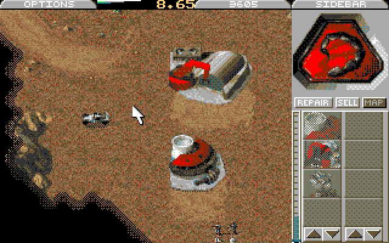

# Command & Conquer — Atari ST port

Work-in-progress port of **Tiberian Dawn** to the Atari ST/STE: native `cnc.tos`, 320×200 planar graphics (BLiTTER), STE DMA audio.

**Status:** Game is rendered in 16 colors; playable in emulation; performance not great (usually single-digit FPS); saving gamestate works, loading has problems; some graphics glitches.

- Upstream Vanilla Conquer (PC, other platforms): **[README-vanilla-conquer.md](README-vanilla-conquer.md)**
- Open tasks & release prep: **[atari-todo.md](atari-todo.md)**
- Port notes (MIX list, `.W16` format): **[tiberiandawn/atari.md](tiberiandawn/atari.md)**

## Requirements

Since this is a work in progress, system requirements are still a little too high for original Atari ST hardware.

Minimum reliable emulation: **Mega STE, 16 MHz, 10 MB RAM, with BLiTTER _and_ DMA audio** (required). Higher CPU speeds improve framerate.  
**We lack real hardware datapoints — feedback welcome!** This is a work-in-progress port (WIP).
> **Goal:** Eventually, the aim is for this port to run on a 4 MB (Mega) STE (or compatible).

## Run

1. Get C&C Tiberian Dawn data ([C&C Communications Center — downloads](https://cnc-comm.com/command-and-conquer/downloads/the-game)). Use the DOS ("C&C Classic") version, not the Windows 95 ("Gold") version.
2. One folder: `cnc.tos`, C&C `.MIX` files, and [`tiberiandawn/atari-assets/`](tiberiandawn/atari-assets/readme.md) sidecars (`.W16`).
3. Repack MIXes before first play with [remix-web](tiberiandawn/tools/remix-web/) (or host [`remix`](tiberiandawn/tools/remix/readme.md) with `./remix -d /path/to/gamedata`) for even-aligned payloads, 11025 Hz mono PCM audio, and optional ST16/SHPX/STVQ conversion.

## Build

`m68k-atari-mint` toolchain; then `cd tiberiandawn && make` → `bin/AtariST/cnc.tos`. On-target tests: `make st-tests` ([readme](tiberiandawn/tests/st_suite/readme.md)).

## Host tools

| Tool | Description |
|------|-------------|
| [remix](tiberiandawn/tools/remix/readme.md) / [remix-web](tiberiandawn/tools/remix-web/) | Repack `.MIX` (even offsets, audio → 11025 Hz PCM, optional ST16/SHPX/STVQ) |
| [paltool](tiberiandawn/tools/paltool/paltool.c) | Extract 768-byte `.PAL` from BMP / CPS / WSA |
| [palette-opt](tiberiandawn/tools/palette-opt/readme.md) | Build `.W16` chunky→planar weight sets |
| [histtool](tiberiandawn/tools/histtool/readme.md) | Frame histograms for `palette-opt --hist` |
| [w16fix](tiberiandawn/tools/palette-opt/readme.md) | Reorder `.W16` hardware pen subset |
| [list_mix](tiberiandawn/list_mix/readme.md) | List MIX contents (CRC, names) |

## Legal

GPL engine code from [Vanilla Conquer](README-vanilla-conquer.md). Not affiliated with EA. You must provide your own game data; do not redistribute EA `.MIX` files with binaries.
